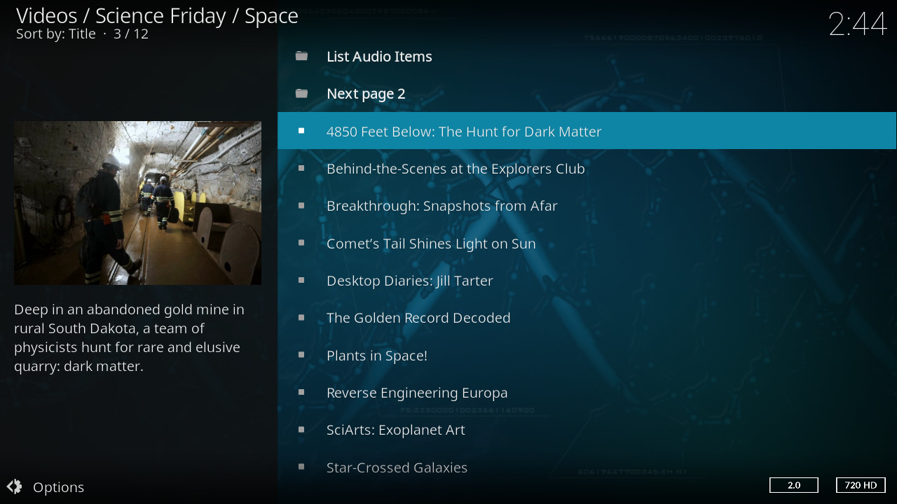

.. image:: https://travis-ci.org/willforde/plugin.video.science.friday.svg?branch=master
    :target: https://travis-ci.org/willforde/plugin.video.science.friday

.. image:: https://coveralls.io/repos/github/willforde/plugin.video.science.friday/badge.svg?branch=master
    :target: https://coveralls.io/github/willforde/plugin.video.science.friday?branch=master

.. image:: https://api.codacy.com/project/badge/Grade/90d91c76170b4c2c962cbb46c62dff12
    :target: https://www.codacy.com/app/willforde/plugin.video.science.friday?utm_source=github.com&amp;utm_medium=referral&amp;utm_content=willforde/plugin.video.science.friday&amp;utm_campaign=Badge_Grade

Science Friday
==============

This is a kodi video add-on for Science Friday science videos.

Science Friday is your trusted source for news and entertaining stories about science.
Started as a radio show, created in 1991 by host and executive producer Ira Flatow. Since then,
weve grown into much more: We produce award-winning digital videos and publish original web content
covering everything from octopus camouflage to cooking on Mars. SciFri is brain fun, for curious people.

The add-on is available in the official kodi repository for kodi v17 "Krypton" and greater.

